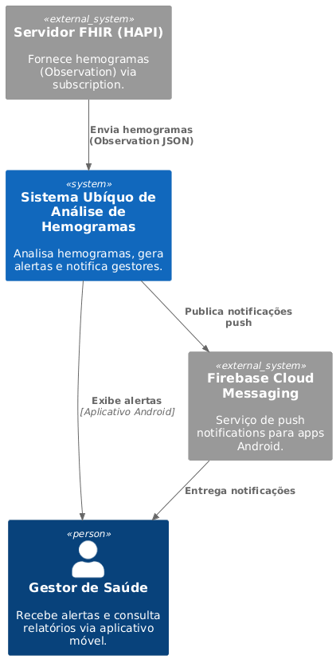

# Diagrama de contexto

Diagrama de contexto elaborado seguindo o modelo C4. Mais informações disponíveis na própria [documentação do modelo.](https://c4model.com/diagrams/system-context)

## Diagrama
 

 ## UML

```
@startuml
!include <C4/C4_Container>

Person(gestor, "Gestor de Saúde", "Recebe alertas e consulta relatórios via aplicativo móvel.")   

System(system, "Sistema Ubíquo de Análise de Hemogramas", "Analisa hemogramas, gera alertas e notifica gestores.")

System_Ext(fhir, "Servidor FHIR (HAPI)", "Fornece hemogramas (Observation) via subscription.")

System_Ext(fcm, "Firebase Cloud Messaging", "Serviço de push notifications para apps Android.")

Rel(fhir, system, "Envia hemogramas (Observation JSON)")
Rel(system, gestor, "Exibe alertas", "Aplicativo Android")
Rel(system, fcm, "Publica notificações push")
Rel(fcm, gestor, "Entrega notificações")

@enduml
```